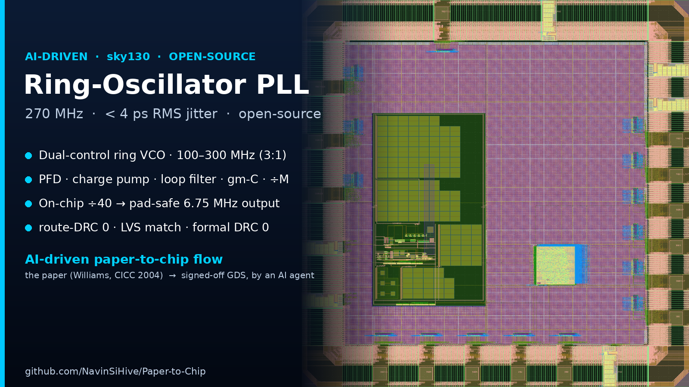
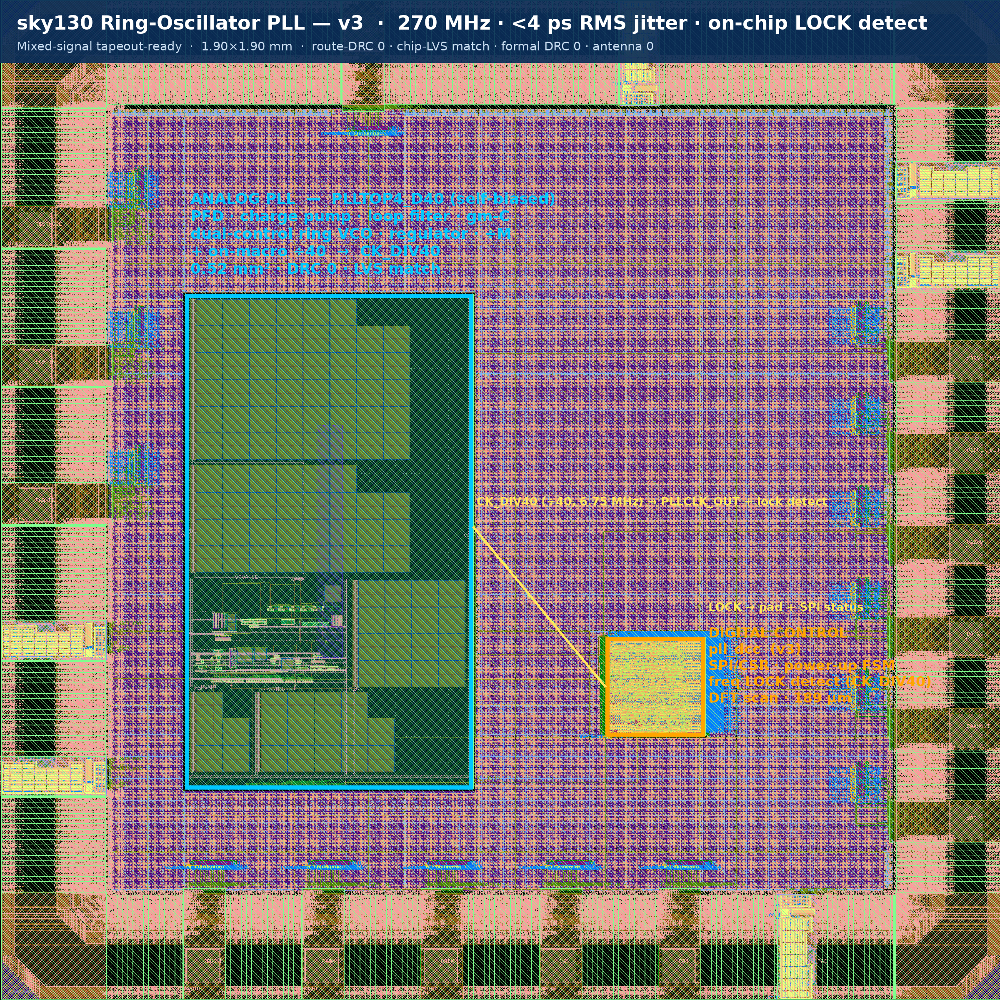
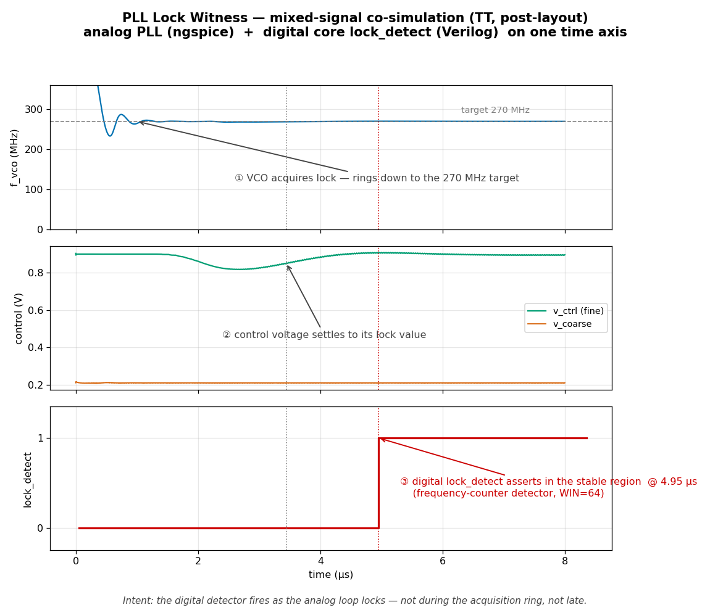

# AI-driven Paper‑to‑Chip: an Open‑Source sky130 Ring‑Oscillator PLL

[](https://si-hive.com)
[](https://si-hive.com/paper-to-chip)
[](https://github.com/google/skywater-pdk)
[](LICENSE)

> **AI‑driven Paper‑to‑Chip.** From the paper (Williams *et al.*, IEEE CICC 2004) to a tapeout‑ready
> sky130 mixed‑signal chip — the RTL, the analog PLL macro, chip integration, and signoff were produced
> by an AI design agent. **📖 Full write-up: [si-hive.com/paper-to-chip](https://si-hive.com/paper-to-chip).**

A dual‑control‑path CMOS **ring‑oscillator PLL** with **< 4 ps RMS accumulated jitter**, reproduced
end‑to‑end on the open‑source **sky130** PDK.



*Final chip: self-biased analog PLL macro `PLLTOP4_D40` (left) + digital control `pll_dcc` (right) +
21‑pad IO ring. 1.90 × 1.90 mm, sky130. The analog macro divides its output by 40 on‑chip
(`CK_DIV40`, ~6.75 MHz) to a pad‑drivable rate.*

## Highlights
- **Full mixed‑signal chip**: analog PLL (PFD, charge pump, loop filter, gm‑C coarse path, dual‑control
  ring VCO, regulator, ÷M feedback) + a digital control/IO subsystem (SPI config, power‑up sequencing,
  lock detect, output‑clock management, DFT scan) + a sky130 pad ring.
- **Signed off**: route‑DRC 0 · chip‑LVS "match uniquely" · **formal DRC 0** (metal fill + standard
  hard‑IP waiver) · antenna 0 · multi‑corner STA clean (100–300 MHz).
- **On‑chip ÷40 output** (`CK_DIV40`): the ~270 MHz (≤300 MHz during lock) VCO clock is divided to
  ~6.75 MHz before the CMOS pad — sky130 has no LVDS, so the fast clock never leaves the analog.
- **Behavioral models included**: SystemVerilog (pre‑ and post‑layout) + a Real‑Number Model (RNM).

## Specs (nominal)
| Parameter | Value |
|---|---|
| Reference / output | 27 MHz → 270 MHz (÷M, M = 10) |
| Tuning range | 100 – 300 MHz (3:1, no band switching) |
| Jitter | < 4 ps RMS (4.83 ps measured close) |
| Phase margin | 70 – 72° (TT/FF) |
| Reference spurs | < −57 dBc |
| Output divider | ÷40 on‑macro → `CK_DIV40` ≈ 6.75 MHz |
| Supply / process | 1.8 V / sky130 (0.36 mm² analog, 1.90 × 1.90 mm chip) |

## Post-layout signoff (all corners)
| Corner | Lock | V_ctrl ripple (mVpp) | Reference spur (dBc) | Deterministic jitter (ps) |
|:---:|:---:|:---:|:---:|:---:|
| **TT** | 270 MHz | 15.2 | −68.5 | **1.96** |
| **SS** | 270 MHz | 6.4 | −74.4 | **0.60** |
| **FF** | 270 MHz | 9.7 | −53.5 | **2.30** |

All three corners lock at 270 MHz with deterministic jitter **< 5 ps**.

### Lock witness — mixed-signal co-simulation


*The analog PLL (ngspice) acquiring lock, with the digital core's `lock_detect` overlaid: `f_vco` rings
down to the 270 MHz target, the control voltage settles, and `lock_detect` asserts in the stable region
(~5 µs) — the digital detector witnessing the analog lock, on one time axis.*

## Repository layout
| Folder | Contents |
|---|---|
| [`gds/`](gds) | generated GDS (compressed): chip + analog macro + digital core |
| [`schematics/`](schematics) | analog design schematics (xschem `.sch`) + device-level SPICE |
| [`symbols/`](symbols) | analog block symbols (xschem `.sym`) + macro abstracts (LEF) |
| [`models/`](models) | SystemVerilog (pre/post‑layout) + Real‑Number (RNM) models + testbench |
| [`cdl/`](cdl) | device‑level CDL / schematic netlists (for LVS) |
| [`reports/`](reports) | signoff reports — [`drc/`](reports/drc) · [`lvs/`](reports/lvs) · [`lock_detect/`](reports/lock_detect) · timing |
| [`docs/`](docs) | architecture, tapeout signoff summary |
| [`doc_images/`](doc_images) | chip + block layout images |

## Simulate the PLL model (2 minutes)
```bash
cd models && ./run_models.sh        # iverilog/Verilator: prelayout · postlayout · RNM → ALL_PASS
```
Checks: PLL_CLK locks to 270 MHz (±1 %), ÷M = 10, post‑layout jitter ≈ 4.83 ps RMS.

## Use the GDS
```bash
gunzip gds/pll_chip.gds.gz          # open in KLayout / magic
```

## What is *not* here
The proprietary automated‑layout engine that generated the analog macro is intentionally excluded — this
repository ships the **generated artifacts** (GDS, models, docs) only. The analog PLL is delivered as a
verified hard macro.

## About & links
Built at **SiHive** — [si-hive.com](https://si-hive.com) · silicon design & EDA automation.

📖 **Full write-up:** [How this PLL went from paper to GDS with an AI design agent](https://si-hive.com/paper-to-chip)
— the corner results, the 100–300 MHz range, the lock-witness, and the open-source story.

💬 **Contact:** questions / collaboration → **assist@si-hive.com**, or open a GitHub issue.

## License
**MIT** (see [LICENSE](LICENSE)). Generated GDS, models, and docs are provided as‑is, without warranty.
